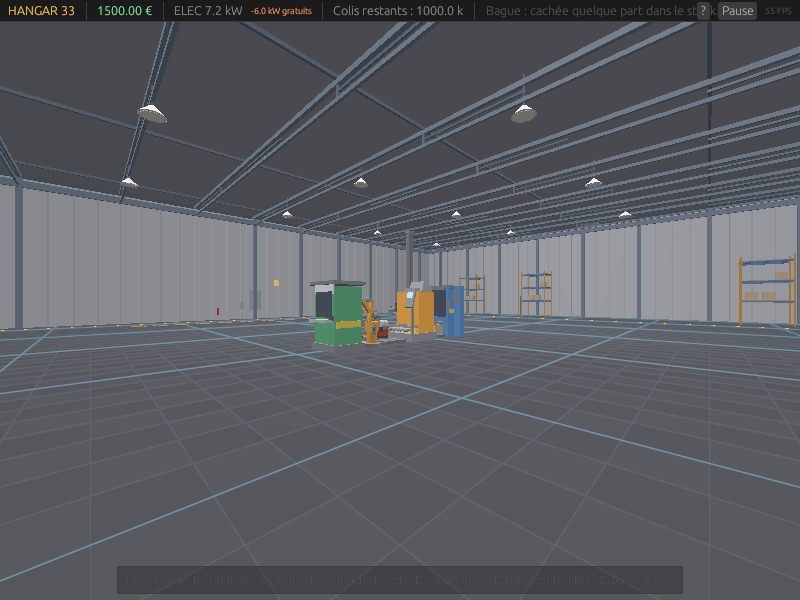

# HANGAR 33 — v0.3.9 « HANGAR-OS 11 »

> Déballe. Automatise. Trouve la bague.
>
> Un jeu d'automatisation 3D à la première personne, dans un vrai hangar Blender,
> inspiré de Factorio/Satisfactory et de la vague « Find The Needle » :
> **le déballage de colis mystères**, pilotable depuis **l'ordinateur du hangar**.



## Nouveautés v0.3.9

- **VM Hyper-V auto-réparée (fix)** : sur certains Windows 11, la VM créée à la
  volée refuse de démarrer avec « Microsoft Guest Runtime State ... .vmgs
  introuvable » (fichier d'état jamais écrit pour une VM à moitié provisionnée).
  Le script du code secret détecte l'échec, **redémarre le service Hyper-V,
  supprime la VM, la recrée proprement** (tout branché avant le premier boot)
  **et retente** — plus de popup d'erreur à gérer à la main.
- **Exécutable Windows officiel** : publiée en [Release
  GitHub](https://github.com/Ahom165/hangar33/releases/latest), liaison
  statique complète (aucune DLL non-système), prête à double-cliquer.

## Nouveautés v0.3.7

- **HANGAR-OS 11** : l'ordinateur du hangar est devenu un **faux bureau Windows 11**
  (clin d'œil assumé) — fond d'écran « bloom », icônes Ce PC / Corbeille (easter
  eggs), **barre des tâches centrée** avec bouton Démarrer et horloge, **menu
  Démarrer** (recherche, apps épinglées, Éteindre) et **fenêtres d'apps**
  superposables : Boutique (Store), Colis (Livraisons), Terminal.
- **Livraisons visibles (fix)** : la zone de palettes est maintenant **DANS le
  hangar** (contre le mur sud, marqueur doré pulsant au-dessus). Avant, le dock
  était à l'extérieur des murs : les colis « livrés » étaient invisibles.
  La barre du haut affiche un **compte à rebours** (« Livraison dans 7 s »).
- **VM bootable** : le code secret cherche maintenant une **ISO Windows** dans
  Téléchargements/Bureau/Documents/C:\ISO (Windows : branchée en DVD de boot,
  2 Go de RAM) — et sur Linux il démarre QEMU sur le **firmware TianoCore
  (OVMF)** : le Boot Manager UEFI s'affiche même sans ISO.

## Nouveautés v0.3

- **HANGAR-OS 33** : un ordinateur de gestion modélisé (bureau, écran, tour,
  chaise) au sud-ouest du hangar. Approche-toi et appuie sur **E** :
  - onglet **Boutique** — commandes machines/tapis **payées à la commande**,
    livrées après ~8 s sur le quai (modèle économique « Find The Needle ») ;
  - onglet **Colis** — commande groupée livrée sur la zone de palettes ;
  - onglet **Terminal** — vraie ligne de commande (`help`, `status`, `stock`,
    `order <item> [qty]`, `order colis <n>`, `clear`)…
- **CODE SECRET** : le pense-bête scotché sur l'écran donne un indice. Taper le
  code dans le terminal déverrouille l'hyperviseur et lance une **VRAIE machine
  virtuelle** sur la machine hôte : **QEMU/KVM** (accélération matérielle,
  repli TCG) sous Linux, **Hyper-V** (VM « HANGAR33-VM » créée à la volée,
  élévation UAC si besoin, console VMConnect) sous
  Windows, **UTM/Virtualization.framework** sous macOS. Parce que c'est drôle.
- **Bras robot** (180 €) : manipulateur universel 1×1 — accepte TOUT, tourne à
  90°, insère directement dans une machine aval. Le tapis-rapide des coins.
  Le flag bague d'un colis fermé **survit** à son transit (test de régression).
- **Générateur** (400 €) : 6 kW gratuits en continu — l'option hors-réseau
  face aux 0,15 €/kWh du fournisseur (l'incinérateur reste l'option risque).
- **11 assets Blender** (via MCP) : shell hangar, 8 machines, colis, ordinateur.

---

## Le jeu en 30 secondes

Une bague rarissime est cachée dans **UN** colis parmi **1 à 500 millions** (choisi
au démarrage, via une seed TRNG). Tu commences à la main : commander des colis à
l'ordinateur (ou au dock), les ouvrir, vendre le contenu. Puis tu automatises :
tu commandes des machines à HANGAR-OS, tu construis Auto-Acheteur → tapis
roulants → Dépaqueteur → Bras robot → Trieur → Guichet de vente… et tu espères
que la bague ne finisse ni au **Guichet** (vente = **−25 % du capital**, elle se
recache), ni dans l'**Incinérateur** (elle brûle, elle se recache). Le
**Scanner à bague** l'intercepte → coffre → **VICTOIRE**.

- **Électricité** : le réseau coûte 0,15 €/kWh. Générateurs (6 kW gratuits) et
  cartons incinérés (2 kW gratuits pendant la combustion) réduisent la facture.
- **Idle** : 0 gain hors-ligne. Le hangar ne travaille que fenêtre ouverte.
- **TRNG** : la seed de partie vient de l'entropie OS (`getrandom` :
  `getrandom(2)` / `/dev/urandom` / `BCryptGenRandom`) + jitter local. Le
  gameplay lui-même utilise un PRNG ChaCha8 seedé par ce TRNG (rapide,
  reproductible avec `--seed`).

## Compilation & lancement

```sh
# Pré-requis : Rust stable (rustup) — aucune autre dépendance système.
cargo run -p h33-app --release
```

Premier lancement : écran-titre → choisis le nombre total de colis (slider
1 M → 500 M) → COMMENCER.

### Compiler sous Windows

> **Tu veux juste JOUER ?** Télécharge l'exécutable prêt à lancer sur la page
> [Releases](https://github.com/Ahom165/hangar33/releases/latest)
> (`hangar33-v0.3.9-windows-x64.zip` → décompresser → double-cliquer
> `hangar33.exe`). Aucune installation requise.

Le crate `h33-app` est un binaire natif : le cible MSVC a besoin du **linker
`link.exe`** fourni par les Build Tools Visual Studio (VS Code ne suffit PAS).
Deux options :

**Option A (recommandée) — installer MSVC Build Tools** via winget
(terminal PowerShell) :

```powershell
winget install Microsoft.VisualStudio.2022.BuildTools --override "--wait --passive --add Microsoft.VisualStudio.Workload.VCTools --includeRecommended"
```

(~7 Go, un seul redémarrage de terminal ensuite ; `cargo b -r` fonctionne
directement, c'est la cible par défaut de rustup sur Windows.)

**Option B — toolchain GNU** : ⚠️ rustup n'embarque PAS MinGW — sans lui la
build échoue avec `error calling dlltool 'dlltool.exe': program not found`
(c'est le même type d'erreur que le `link.exe` manquant, la toolchain GNU
n'est donc « sans installation » que si tu as DÉJÀ un MinGW-w64 dans ton
PATH, par ex. MSYS2) :

```powershell
winget install MSYS2.MSYS2          # puis dans le shell MSYS2 :
# pacman -S --noconfirm mingw-w64-x86_64-toolchain
# ajouter C:\msys64\mingw64\bin au PATH Windows, puis :
rustup toolchain install stable-x86_64-pc-windows-gnu
rustup default stable-x86_64-pc-windows-gnu
cargo b -r
```

Dans les deux cas, `target\release\hangar33.exe` est le jeu ; il se déplace
librement (aucune DLL externe requise).

### Flags utiles

| Flag | Effet |
|---|---|
| `--total <n>` | préremplit le nombre de colis (1 000 000..500 000 000) |
| `--seed <hex64>` | rejoue une partie à l'identique (empreinte affichée au menu) |
| `--smoke-test` | partie scriptée automatique + exit 0 (CI) |
| `--screenshot <png>` | capture la frame réelle (avec UI) pendant le smoke-test |
| `--frames <n>` | quitte après n frames |

### Sans GPU : tester avec lavapipe (software Vulkan)

Le repo embarque un environnement user-space (aucune installation système) :

```sh
source scripts/dev-env.sh        # active lavapipe (VK_ICD_FILENAMES + LD_LIBRARY_PATH)
cargo test                       # logique (headless) + rendu offscreen
xvfb-run -a cargo run -p h33-app -- --smoke-test --screenshot docs/screenshots/smoke.png
# ou tout-en-un :
bash scripts/test-gpu.sh
```

Vérifié ici : adapter `llvmpipe (Cpu) — backend Vulkan`, 140 FPS en fenêtre
1280×800 sur le vertical slice.

## Contrôles (vue première personne)

| Action | Entrée |
|---|---|
| Capture / libérer la souris | **Clic gauche** en jeu / **Échap** |
| Regarder | **Souris** (raw input — marche même curseur pincé) |
| Marcher | **ZQSD / WASD** (touches physiques — AZERTY et QWERTY) |
| Sprinter | **Shift** |
| Utiliser l'ordinateur (à proximité) | **E** |
| Choisir le stock à poser | **1-9** (sélection directe) |
| Construire / sélectionner (crosshair) | **Clic gauche** (souris capturée) |
| Colis du dock sud | **F** ouvrir / vendre · **Shift+F** revente à l'aveugle |
| Orientation (tapis/machines) | **R** |
| Pelle (démolir, 50 % remboursé) | **X** |
| Annuler / désélectionner | **Échap** |
| Pause | **Espace** |
| Aide | **H** |

L'écran de jeu est volontairement PROPRE : pas de panneau latéral ni de barre
de boutons — tout passe par le crosshair, les touches 1-9, F et l'ordinateur.
Une seule ligne d'aide discrète en bas, un prompt contextuel au centre
("[F] Ouvrir le colis…", "[E] Utiliser l'ordinateur").

Le joueur circule à hauteur des yeux (1,7 m) dans un vrai hangar : dalle béton,
murs tôles nervurées, charpente acier, lanterneaux, lampes industrielles, racks
et zones de stockage. La visée se fait au crosshair (centre de l'écran) ; les
machines et colis sont des modèles Blender (GLB) placés/orientés par la sim.

## Architecture (multijoueur-ready dès le jour 1)

```
crates/
├── h33-core/     LOGIQUE PURE — zéro dépendance graphique
│   ├── rng.rs      TRNG (seed unique) + ChaCha8 (gameplay, sans biais)
│   ├── items.rs    catalogue objets/raretés/table de loot
│   ├── grid.rs     grille, tapis (slots façon Factorio), directions
│   ├── machines.rs contrats d'acceptation des machines
│   ├── economy.rs  argent, pool de colis, RÈGLES DE LA BAGUE
│   ├── shop.rs     catalogue HANGAR-OS, prix, délais de livraison
│   ├── sim.rs      tick fixed-timestep 60 Hz, systèmes ordonnés déterministes
│   ├── ecs.rs      mini-ECS sparse-set (couche VFX, v0.2)
│   └── balance.rs  ⭐ TOUTES les constantes d'équilibrage (itère ici)
├── h33-render/   wgpu — 1 draw call instancié + lots de meshes GLB
│   ├── renderer.rs pipeline scène (lambert stylisé + fog) + sol (grille WGSL)
│   ├── assets.rs   11 GLB Blender embarqués (shell, 8 machines, colis, ordinateur)
│   ├── gltf_asset.rs parseur GLB (positions/normales/couleurs matériaux cuites)
│   ├── surface.rs  swapchain, resize, depth, capture frame
│   ├── camera.rs   première personne + orbite (debug/tests) + rayon picking
│   └── picker.rs   ray-AABB / pick cellule
└── h33-app/      winit + egui — fenêtre, HUD, pointer lock, boucle, smoke-test
    └── vm.rs       easter egg : le code secret lance une VRAIE VM (KVM/Hyper-V)
```

**Choix clés :**
- **`h33-core` est un serveur en attente** : pas de GPU, pas d'horloge, tick
  déterministe, ordre d'itération stable (Vec + indices). Le multijoueur
  (v0.4) = le serveur exécute `Sim::tick` et rejoue les commandes joueurs.
- **Items sur tapis ≠ entités libres** : 1 slot par cellule (le pattern
  historique de Factorio) → des milliers d'objets sans collisions, itération
  cache-friendly, zéro allocation au tick.
- **Rendu** : hangar + machines + colis en GLB Blender (couleurs matériaux cuites
  dans les sommets, fake AO par normale) ; tapis/objets/marqueurs en cubes
  instanciés ; un `draw_indexed` par lot, instances concaténées en un upload.

## Assets Blender (pipeline MCP)

Les modèles sont générés par **Blender 4.2 piloté via le serveur socket MCP**
(`mcp-for-blender`, protocole JSON port 9876, commandes `execute_code`) :

```sh
scripts/bl/b1_shell.py      # enveloppe : dalle, murs, charpente, lampes, props
scripts/bl/b2_machines.py   # 6 machines + colis (à l'origine, face -Y)
scripts/bl/b3_export.py     # exports GLB + .blend + rendus Cycles de contrôle
scripts/bl/b4_new_assets.py # v0.3 : ordinateur (CO_), bras robot (RA_), générateur (GE_)
scripts/bl/b5_export_new.py # exports des 3 GLB v0.3 + rendus de contrôle
scripts/run_blender_phase.sh scripts/bl/b1_shell.py ...   # Xvfb + Blender + client MCP
```

Les GLB sont **compilés dans le binaire** (`include_bytes!`) : pas d'IO runtime.
Le loader (`gltf_asset.rs`) applique les transforms de nodes, cuit les couleurs
de matériaux × fake AO dans les sommets, fusionne en 1 mesh par fichier
(shell ~8 700 tris, machines 130–1 600 tris). Convention : mètres, +Y up,
machines regardant +Z (yaw = atan2(dx, dz) de leur `Dir`).

## Tests

```sh
cargo test                       # 30+ tests : économie, bague, boutique/livraisons,
                                 # bras robot (flag bague), générateur, rendu
bash scripts/test-gpu.sh         # + suite GPU (lavapipe) avec screenshots
```

Couverture notable : la bague n'est **jamais** dans un colis déjà acheté ;
vente = exactement −25 % et re-masquage strict dans les colis restants ;
pool épuisé → réapprovisionnement ; trieur alternant strictement ;
blackout gelant tout sauf la vente manuelle ; reproductibilité par seed ;
**commande HANGAR-OS payée à la commande, livrée à l'eta, placement consommant
le stock** ; **flag bague préservé par le bras robot** ; **6 kW gratuits du
générateur annulant la facture réseau** ; chaîne AutoBuyer→…→Bras→Guichet
productive de bout en bout (smoke-test 60 Hz sous Xvfb, exit 0).

## Équilibrage (iterate here)

Tout est dans [`crates/h33-core/src/balance.rs`](crates/h33-core/src/balance.rs) :
prix colis (12 €), marge EV, coûts machines, kW, vitesses, pénalité bague (25 %),
bornes du pool (1 M..500 M). Changer une valeur = recompiler.
